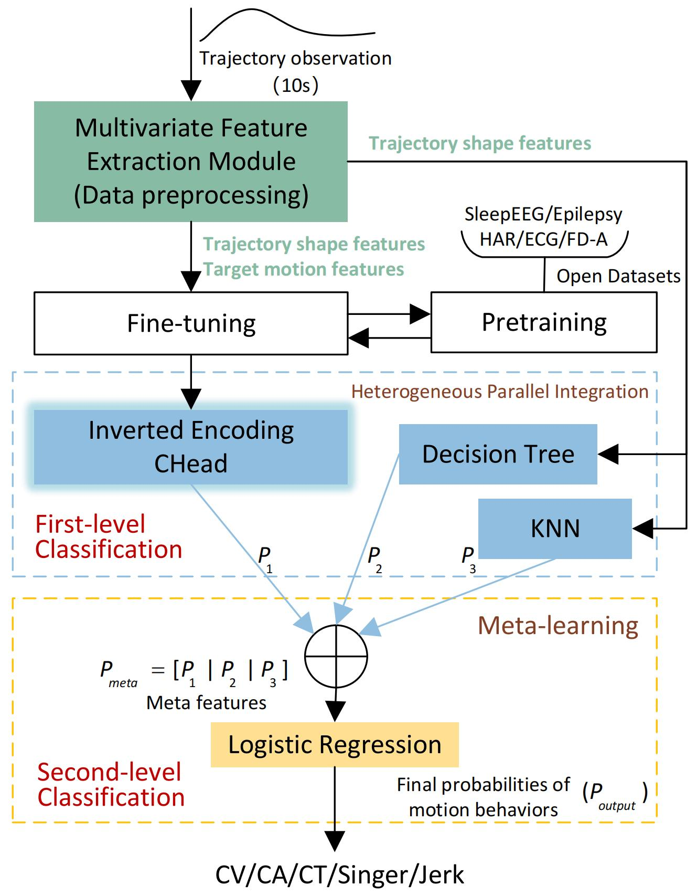

## MetaMLIR: Meta-learning with Multilevel Integration for Motion Pattern Recognition of Maneuvering Targets



## Algorithm Introduction
We introduce a two-level meta-learning-based classification method (MetaMLIR) and construct an open-source target motion trajectory dataset (TMT dataset). Experiments on both the self-developed TMT dataset and the real-world NCLT dataset demonstrate that the proposed method achieves improved recognition performance under both non-pattern-switching and pattern-switching scenarios. The primary contributions of this paper are as follows:
1.  We propose a two-level meta-learning-based recognition method (MetaMLIR) that reduces the latent search space and improves robustness under noisy observations.
2.  We construct and release an open-source target motion trajectory dataset (TMT) with diverse motion patterns and controllable simulation settings.
3.  We conduct extensive experiments on TMT and the real-world NCLT dataset, demonstrating consistently strong performance in both non-switching and switching settings.

## Dataset Introduction
The TMT dataset is a synthesized dataset generated using Python scripts based on the State Space Model (SSM) with radar nonlinear measurements. The TMT dataset offers three advantages:

1.  Rich diversity of motion patterns. The dataset incorporates five distinct motion patterns, covering a broader spectrum of maneuvering scenarios.
2.  Flexible parameterization. As summarized in Table II, key factors such as target motion states, simulation duration, and measurement noise levels can be flexibly adjusted, enabling customized dataset generation under various motion conditions.
3.  Switching and non-switching scenarios. The dataset supports both non-pattern-switching and pattern-switching cases, providing full control over pattern combinations and maneuver durations.
## Usage

This section describes how to generate the dataset and run the two-level motion-pattern recognition pipeline (first-level heterogeneous classifiers + second-level meta-learning fusion).

### Data generation
Generate the synthetic radar trajectory dataset by running:
```bash
python radar_data_gen.py
```
### First-level classifiers

The first-level stage produces preliminary class scores using multiple heterogeneous classifiers:

1.  Inverted-coding classification head with backbone network: `ICH_backbone_classifier.py`
2.  Decision Tree classifier: `decisiontree_classifier.py`
3.  K-Nearest Neighbors (KNN) classifier: `knn.py`
### Second-level meta-classifier

The second-level stage performs meta-learning-based fusion over the first-level outputs and produces the final motion-pattern prediction:
```bash
python meta-learning.py
```
## Citation
If you find the code useful, please consider citing our paper using the following BibTeX entry.
```bibtex
@ARTICLE{MetaMLIR,
  author={Ma, Zhenzhen and An, Wei and Huang, Yuan},
  journal={IEEE Transactions on Aerospace and Electronic Systems}, 
  title={MetaMLIR: Meta-Learning With Multilevel Integration for Motion Pattern Recognition of Maneuvering Targets}, 
  year={2026},
  pages={1-11},
  doi={10.1109/TAES.2026.3676433}}
  ```
## Acknowledge
[1] The backbone network for pretraining in the first-level classifiers is largely adapted from [SimMTM](https://github.com/thuml/SimMTM). Thanks to Jiaxiang Dong.

[2] The data generation scripts for the CT motion pattern are adapted from [DeepMTT](https://github.com/ljx43031/DeepMTT-algorithm). Thanks to Jingxian Liu.
